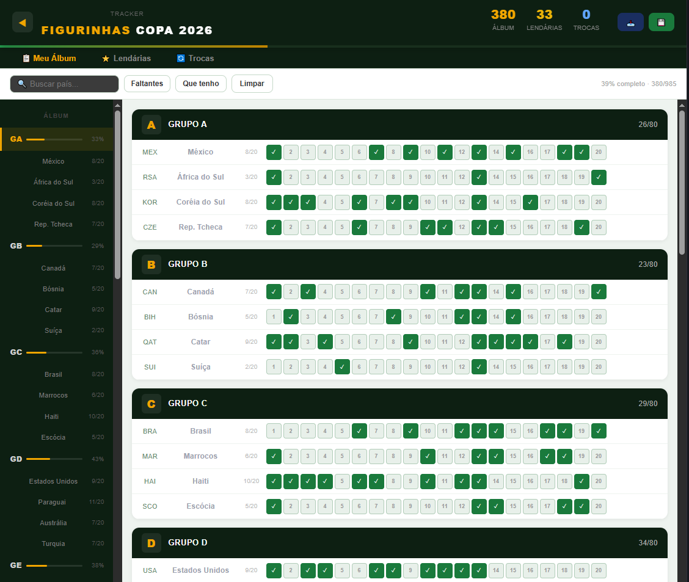

# Álbum de Figurinhas — Copa do Mundo 2026

Aplicação web para acompanhar a coleção do álbum de figurinhas da Copa do Mundo 2026: marque o que você já tem, veja o que falta e organize as trocas.

**Demonstração:** https://giovannilidio.github.io/album-copa-2026/



## Funcionalidades

- **Meu Álbum:** grade de figurinhas organizada por grupo e por país, com contador de progresso
- **Lendárias:** aba dedicada às figurinhas especiais
- **Trocas:** aba para organizar as figurinhas de troca
- **Busca e filtros:** buscar país, ver só as que faltam ou só as que já tenho
- **Salvamento automático** no navegador (localStorage), sem cadastro
- **Salvar e restaurar por código**, para levar o progresso para outro aparelho

## Tecnologias

- React 19
- JavaScript
- Vite
- HTML e CSS
- GitHub Pages (publicação)

## Como rodar localmente

```bash
git clone https://github.com/GiovanniLidio/album-copa-2026.git
cd album-copa-2026
npm install
npm run dev
```

Depois, abra o endereço que aparecer no terminal (normalmente http://localhost:5173).

## O que aprendi

- Gerenciamento de estado com `useState` e `useEffect`
- Persistência de dados com `localStorage`
- Organização de uma aplicação React e publicação com GitHub Pages

## Autor

**Giovanni Lidio dos Santos**
[LinkedIn](https://linkedin.com/in/giovannilidio) · [GitHub](https://github.com/GiovanniLidio)